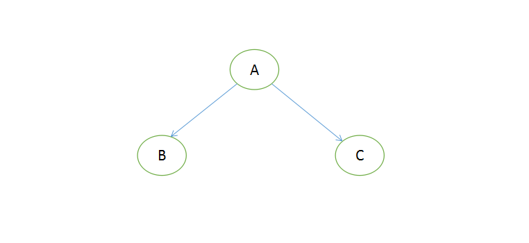
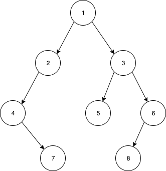

# 剑指offer编程题练习

[TOC]

## 前言

本文记录本人剑指offer编程题的解题思路，题目从牛客网获取，地址https://www.nowcoder.com/ta/coding-interviews?page=1


## 1.二维数组中的查找

在一个二维数组中（每个一维数组的长度相同），每一行都按照从左到右递增的顺序排序，每一列都按照从上到下递增的顺序排序。请完成一个函数，输入这样的一个二维数组和一个整数，判断数组中是否含有该整数。
该题在一个横竖都是递增有序的长度相等的二维数组中找到一个数。可以直接遍历所有得出答案，但那就太low太暴力了。

**解题思路：**

我们可以参考二分查找的思想，从中间值开始查找目标数。那么二维数组的中间值在哪里？已知二维数组是从左到右，从上到下都是递增的，所以我们可以从左下角或右上角开始查找。以从左下角的数n开始查找为例，左边的数大，上面的数小。n与目标数比较时，如果目标数大于n，则右移；如果目标数小于n，则上移；如果相等返回true。移动后，继续同样的逻辑，直到下标达到临界值。

**JAVA代码：**

```java
public boolean Find(int target, int[][] array) {
    int rowCount = array.length;
    int colCount = array[0].length;

    for (int i = rowCount - 1, j = 0; i >= 0 && j < colCount;) {
        if (array[i][j] == target) {
            return true;
        }
        if (array[i][j] < target) {
            j++;
            continue;
        }
        if (array[i][j] > target) {
            i--;
        }
    }
    return false;
}
```


## 2.替换空格

请实现一个函数，将一个字符串中的每个空格替换成“%20”。例如，当字符串为We Are Happy.则经过替换之后的字符串为We%20Are%20Happy。

**解题思路：**

这题没有什么好说的，遍历字符串，如果是空字符，将其替换为20%即可，要注意下标的变化，替换为20%后下标要+3再开始下一次的判断。

**JAVA代码：**

```java
public String replaceString(StringBuffer str) {
    if (str == null) {
        throw new NullPointerException();
    }
  
    int i = 0;
    while (i < str.length()) {
        if (str.charAt(i) == ' ') {
            str.replace(i, i + 1, "%20");
            i += 3;
        } else {
            i++;
        }
    }
    return str.toString();
}
```


## 3.从尾到头打印链表

输入一个链表，按链表从尾到头的顺序返回一个ArrayList。

**解题思路：**

一看题目，会想到可以直接从尾部遍历链表吗？题目给出的链表当然是不可以的，只能从头遍历了。由于结果要逆序放在一个数组里，遍历的时候是顺序的，可以使用stack栈这个数据结构来存储遍历出来的数，最后再放入到数组中去。

**JAVA代码：**

```java
/**
*    public class ListNode {
*        int val;
*        ListNode next = null;
*
*        ListNode(int val) {
*            this.val = val;
*        }
*    }
*
*/
import java.util.ArrayList;
import java.util.Stack;
public class Solution {
    public ArrayList<Integer> printListFromTailToHead(ListNode listNode) {
        Stack<Integer> stack = new Stack<>();
        while (listNode != null) {
            stack.push(listNode.val);
            listNode = listNode.next;
        }
        
        ArrayList<Integer> result = new ArrayList<>(stack.size());
        while (!stack.empty()) {
            result.add(stack.pop());
        }
        return result;
    }
}
```


## 4.重建二叉树

输入某二叉树的前序遍历和中序遍历的结果，请重建出该二叉树。假设输入的前序遍历和中序遍历的结果中都不含重复的数字。例如输入前序遍历序列{1,2,4,7,3,5,6,8}和中序遍历序列{4,7,2,1,5,3,8,6}，则重建二叉树并返回。

**解题思路：**

说实话，看了题目我也有点懵，啥是前序遍历和中序遍历？好像还有个叫后序遍历吧，都已经忘了，那就重新捡起来吧！



**前序遍历：**

对于当前节点，先输出该节点，然后输出他的左孩子，最后输出他的右孩子。对应顺序为ABC

**中序遍历：**

对于当前结点，先输出它的左孩子，然后输出该结点，最后输出它的右孩子。对应顺序为BAC

**后序遍历：**

对于当前结点，先输出它的左孩子，然后输出它的右孩子，最后输出该结点。对应顺序为BCA

了解到这三种遍历方法后，可以知道，前序遍历的第一个数，一定是根结点，中序遍历从开始到根结点数的范围，是二叉树根节点的左子树。

如题目所述的前序遍历序列{1,2,4,7,3,5,6,8}和中序遍历序列{4,7,2,1,5,3,8,6}，根节点是1，从中序遍历序列知道，{4，7，2}是左子树的中序遍历序列，{5，3，8，6}是右子树的中序遍历序列。再从前序遍历序列中知道，{2，4，7}是左子树的前序遍历序列，{3，5，6，8}是右子树的前序遍历序列

对于左子树：2是根节点，{4，7}是左子树的中序遍历序列，{4，7}是左子树的前序遍历序列。通过前序遍历序列得知4是左子树根结点，由中序遍历序列{4，7}可知，7是右子树的前序遍历序列。

按照这套逻辑，最后得出树如下：



总结一下，递归重建二叉树的逻辑：

1.通过前序遍历序列的第一位开始遍历，是树的根节点

2.在中序遍历序列中，找到该根结点数，左右两边的序列就是左子树和右子树的中序遍历序列，得出左子树节点数量A和右子树的节点数量B

3.回到前序遍历序列，找到左子树的前序遍历序列和右子树的前序遍历序列，从第一位开始，后面的A位就是左子树的前序遍历序列，再后面的B位就是右子树的前序遍历序列

4.对于左子树和右子树，各自重新从第一步开始重建二叉树

**JAVA代码：**

```java
public TreeNode reConstructBinaryTree(int [] pre, int [] in) {
    return reConstructBinaryTree(pre, in, 0, pre.length - 1, 0, in.length - 1);
}


/**
 * 递归重建二叉树
 *
 * @param pre     前序遍历序列
 * @param in      中序遍历序列
 * @param preLow  前序遍历序列低位下标
 * @param preHigh 前序遍历序列高位下标
 * @param inLow   后序遍历序列低位下标
 * @param inHigh  后序遍历序列高位下标
 * @return
 */
public TreeNode reConstructBinaryTree(int[] pre, int[] in, int preLow, int preHigh, int inLow, int inHigh) {
    if (preHigh < preLow || inHigh < inLow) {
        return null;
    }

    // 前序遍历的第一个数是根结点
    int rootVal = pre[preLow];
    TreeNode root = new TreeNode(rootVal);
    for (int i = inLow; i <= inHigh; i++) {
        if (in[i] == rootVal) {
            // 计算左子树的节点数量
            int leftTreeNodeNum = i - inLow;
            // 左子树前序遍历序列和右子树前序遍历序列的分割点下标
            int preMid = preLow + leftTreeNodeNum;
            root.left = reConstructBinaryTree(pre, in, preLow + 1, preMid, inLow, i);
            root.right = reConstructBinaryTree(pre, in, preMid + 1, preHigh, i + 1, inHigh);
        }
    }
    return root;
}
```


## 5.用两个栈实现队列

用两个栈来实现一个队列，完成队列的Push和Pop操作。 队列中的元素为int类型。

**解题思路：**

队列的特点是先进先出，push是从尾部加入，pop是从头部出来。而栈是后进先出，与队列不一样。如果使用两个栈来实现队列的话，首先是push方法，直接使用栈的push就可以，主要是pop方法，需要将栈底部的元素拿出来，才能满足队列的要求，所以这里只能使用另一个栈来接收栈pop出来的元素，最后在最顶部的就是队列的头部元素。

**JAVA代码：**

```java
public class Solution {
    Stack<Integer> stack1 = new Stack<>();
    Stack<Integer> stack2 = new Stack<>();

    public void push(int node) {
        stack1.push(node);
    }

    public int pop() {
        if (stack2.isEmpty()) {
            while (!stack1.isEmpty()) {
                stack2.push(stack1.pop());
            }
        }

        return stack2.pop();
    }
}
```


## 6.旋转数组的最小数字

把一个数组最开始的若干个元素搬到数组的末尾，我们称之为数组的旋转。

输入一个非递减排序的数组的一个旋转，输出旋转数组的最小元素。
例如数组{3,4,5,1,2}为{1,2,3,4,5}的一个旋转，该数组的最小值为1。
NOTE：给出的所有元素都大于0，若数组大小为0，请返回0。

**解题思路：**

直接遍历数组，相邻的两个数，如果下一位比上一位小，那么下一位就是最小元素。

```java
public static int minNumberInRotateArray(int [] array) {
    for (int i = 0; i < array.length - 1; i++) {
        if (array[i] > array[i + 1]) {
            return array[i + 1];
        }
    }
    return array[0];
}
```

还有二分查找法，这里略过。


## 7.斐波那契数列

大家都知道斐波那契数列，现在要求输入一个整数n，请你输出斐波那契数列的第n项（从0开始，第0项为0）。

n<=39

**解题思路：**

先了解啥是斐波那契数列：

斐波那契数列（Fibonacci sequence），又称[黄金分割](https://baike.baidu.com/item/黄金分割/115896)数列、因[数学家](https://baike.baidu.com/item/数学家/1210991)列昂纳多·斐波那契（Leonardoda Fibonacci）以兔子繁殖为例子而引入，故又称为“[兔子数列](https://baike.baidu.com/item/兔子数列/6849441)”，指的是这样一个数列：1、1、2、3、5、8、13、21、34、……在数学上，斐波那契数列以如下被以[递推](https://baike.baidu.com/item/递推/1740695)的方法定义：*F*(1)=1，*F*(2)=1, *F*(n)=*F*(n - 1)+*F*(n - 2)（*n* ≥ 3，*n* ∈ N*）在现代物理、准[晶体结构](https://baike.baidu.com/item/晶体结构/10401467)、化学等领域，斐波纳契数列都有直接的应用，为此，美国数学会从 1963 年起出版了以《斐波纳契数列季刊》为名的一份数学杂志，用于专门刊载这方面的研究成果。——参考自百度百科

在这道题目中，n从0开始，区分0，1，和n>1的情况，当n>1时，*F*(n)=*F*(n - 1)+*F*(n - 2)

**JAVA代码：**

```java
public int Fibonacci(int n) {
    if (n == 0) {
        return 0;
    }
    if (n == 1) {
        return 1;
    }
    return Fibonacci(n - 1) + Fibonacci(n - 2);
}
```


## 8. 跳台阶

一只青蛙一次可以跳上1级台阶，也可以跳上2级。求该青蛙跳上一个n级的台阶总共有多少种跳法（先后次序不同算不同的结果）。

**解题思路：**

先列出来各种情况：

1级：1种 1

2级：2种 11 2

3级：3种 111 12 21

4级：5种 1111 112 211 121 22

5级：8种 11111 1112 122 212 2111 221 1211 1121

发现一个规律，大于2级台阶，f(n) = f(n-1)+f(n-2)，是一个斐波那契数列

可以这样思考：一次只能跳一级或者两级，那么只需考虑前一级台阶再跳一级，或者前两级台阶再跳两级的种数的和。实现参考斐波那契数列的计算。

**JAVA代码：**

```java
public int JumpFloor(int target) {
    if (target <= 0) {
        throw new IllegalArgumentException();
    }
    if (target == 1) {
        return 1;
    }
    if (target == 2) {
        return 2;
    }
    return JumpFloor(target - 1) + JumpFloor(target - 2);
}
```


